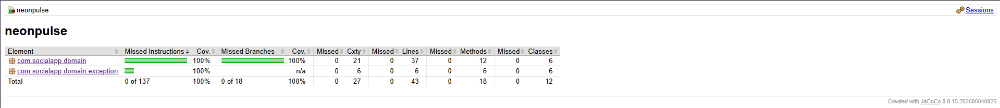

# Sistema de Autenticación — NeonPulse

Proyecto integrador autónomo: un sistema de autenticación para una red social, construido en Java puro aplicando **TDD (Test-Driven Development)** y **Arquitectura Limpia con patrones tácticos de DDD (Diseño Guiado por el Dominio)**.

Nace como ejercicio de TDD (Hito 1: cada clase surge de un test que primero falla, ciclo Red-Green-Refactor) y evoluciona en el Hito 3 hacia una arquitectura en capas desacopladas: el núcleo del negocio (`domain`) es 100% Java puro, sin conocer nada de frameworks ni de infraestructura, y toda dependencia hacia el exterior se invierte a través de interfaces (patrón Repositorio / puertos).

## Tecnologías

- Java 17
- Maven
- JUnit 5 (6.1.2)
- Mockito (5.23.0)
- JaCoCo (cobertura de código)

## Arquitectura: mapa de paquetes

```
com.socialapp
├── Main.java                      # Composition root: conecta infrastructure con application
│
├── domain/                        # CAPA DE DOMINIO — Java puro, cero frameworks
│   ├── entity/
│   │   └── User.java               # Entidad con identidad (email) y comportamiento (authenticatesWith)
│   ├── valueobject/
│   │   ├── Email.java              # Value Object (record) auto-validante
│   │   └── Password.java           # Value Object (record) auto-validante
│   ├── exception/                  # Excepciones de negocio
│   ├── repository/
│   │   └── UserRepository.java     # Contrato de persistencia (solo interfaz)
│   └── service/
│       └── VerificationCodeValidator.java  # Regla de negocio pura
│
├── application/                   # CAPA DE APLICACIÓN — orquesta casos de uso
│   ├── usecase/
│   │   ├── RegisterUserUseCase.java
│   │   ├── LoginUserUseCase.java
│   │   └── SendVerificationCodeUseCase.java
│   └── port/
│       └── EmailNotifier.java      # Puerto de salida hacia un servicio externo de email
│
└── infrastructure/                # CAPA DE INFRAESTRUCTURA — detalles técnicos
    ├── persistence/
    │   └── InMemoryUserRepository.java   # Implementación concreta de UserRepository
    └── notification/
        └── ConsoleEmailNotifier.java     # Implementación concreta de EmailNotifier
```

**Regla de dependencia:** las flechas de conocimiento solo apuntan hacia adentro. `infrastructure` conoce e implementa contratos de `domain`/`application`; `application` orquesta el `domain` a través de sus interfaces; `domain` no importa nada de `application` ni de `infrastructure`. Los casos de uso reciben sus dependencias (`UserRepository`, `EmailNotifier`) por **inyección de constructor** — nunca se instancia una implementación concreta con `new` dentro de un caso de uso. El único lugar donde se conectan las implementaciones concretas con los casos de uso es `Main.java` (composition root).

## Componentes principales

| Clase | Capa | Responsabilidad |
|---|---|---|
| `Email` | domain.valueobject | Value Object inmutable que valida el formato de un correo al construirse |
| `Password` | domain.valueobject | Value Object inmutable que valida la fortaleza de una contraseña al construirse |
| `User` | domain.entity | Entidad de dominio con identidad propia (`id`, generado al registrarse) y comportamiento (`authenticatesWith`) |
| `UserRepository` | domain.repository | Contrato de persistencia de usuarios (interfaz, sin dependencias técnicas) |
| `VerificationCodeValidator` | domain.service | Compara un código ingresado contra el generado |
| `RegisterUserUseCase` | application.usecase | Registra un usuario nuevo, validando email, contraseña y duplicados |
| `LoginUserUseCase` | application.usecase | Autentica a un usuario existente contra el repositorio |
| `SendVerificationCodeUseCase` | application.usecase | Envía un código de verificación a través de un `EmailNotifier` |
| `EmailNotifier` | application.port | Puerto de salida para notificar por correo |
| `InMemoryUserRepository` | infrastructure.persistence | Implementación en memoria de `UserRepository` |
| `ConsoleEmailNotifier` | infrastructure.notification | Implementación de `EmailNotifier` que imprime en consola |

## Instrucciones de ejecución

Compilar y verificar el proyecto:

```
mvn clean compile
```

Ejecutar la suite de pruebas unitarias (valida el desacoplamiento entre capas mediante mocks de Mockito sobre las interfaces de dominio):

```
mvn test
```

Cada test se imprime individualmente en la consola, agrupado por clase (gracias a una extensión de JUnit 5 personalizada: `ConsoleTestLogger`). Al final se muestra el reporte de cobertura de JaCoCo.

Ejecutar la aplicación de demostración (registra, envía código y autentica a un usuario usando las implementaciones en memoria/consola):

```
mvn compile exec:java -Dexec.mainClass="com.socialapp.Main"
```

## Cobertura de código



## Metodología

Cada clase nace de un test que primero falla (**RED**), luego se escribe la mínima lógica necesaria para pasarlo (**GREEN**), y solo entonces se limpia el código si hace falta (**REFACTOR**). Las dependencias externas (envío de correos, persistencia de usuarios) se abstraen detrás de interfaces del dominio/aplicación y se simulan con **mocks de Mockito** en los tests, para no depender de implementaciones concretas.
